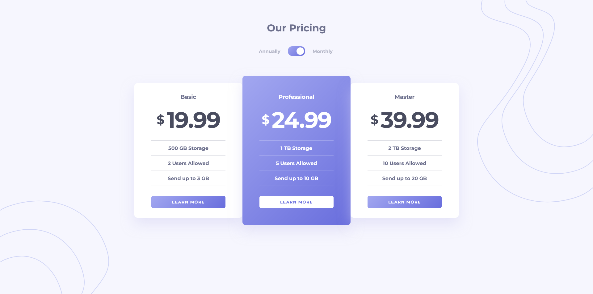
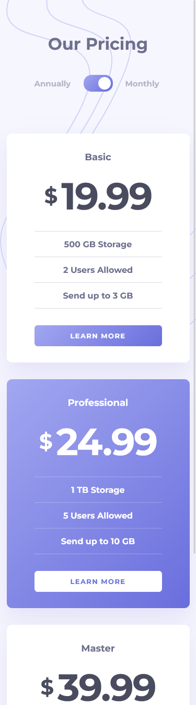

# Frontend Mentor - Pricing component with toggle solution

This is a solution to the [Pricing component with toggle challenge on Frontend Mentor](https://www.frontendmentor.io/challenges/pricing-component-with-toggle-8vPwRMIC). Frontend Mentor challenges help you improve your coding skills by building realistic projects.

## Table of contents

- [Overview](#overview)
  - [The challenge](#the-challenge)
  - [Screenshot](#screenshot)
  - [Links](#links)
- [My process](#my-process)
  - [Built with](#built-with)
  - [Useful resources](#useful-resources)
- [Author](#author)

## Overview

### The challenge

Users should be able to:

- View the optimal layout for the component depending on their device's screen size
- Control the toggle with both their mouse/trackpad and their keyboard
- **Bonus**: Complete the challenge with just HTML and CSS

### Screenshot

### Links

- Solution URL: [github](https://github.com/spaprocki/pricing-component-with-toggle)
- Live Site URL: [netlify](https://spaprocki-pricing-component-toggle.netlify.app)

## My process

### Built with

- Semantic HTML5 markup
- CSS custom properties
- Flexbox
- CSS Grid
- Mobile-first workflow
- Javascript
- [SASS](https://sass-lang.com/)
- [BEM](https://getbem.com/)
- [px to rem](https://marketplace.visualstudio.com/items?itemName=sainoba.px-to-rem) - VSCode snippet

### Useful resources

- [A modern CSS Reset](https://piccalil.li/blog/a-modern-css-reset/) - This is a reset stylesheet I am planning to use in my following coding projects
- [Modern Fluid Typography Using CSS Clamp](https://www.smashingmagazine.com/2022/01/modern-fluid-typography-css-clamp/) - This is an amazing article which helped me finally implement CSS Clamp for fluid change of font-size between screen sizes, while mixing rem and vw to express font-size. I'd recommend it to anyone still learning this concept
- [Accessible icon links](https://kittygiraudel.com/2020/12/10/accessible-icon-links/) - An article on writing accessible icon links
- [CSS filter generator](https://codepen.io/sosuke/pen/Pjoqqp) - A codepen snippet for applying filters to icons
- [SmolCSS](https://smolcss.dev/) - Minimal snippets for modern CSS layouts and components
- [Minimum Static Site Setup with Sass](https://thinkdobecreate.com/articles/minimum-static-site-sass-setup/) - I take my package.json file for building a static website from this article
- [On Designing and Building Toggle Switches](https://www.sarasoueidan.com/blog/toggle-switch-design/) - An article on building accessible toggle switches

## Author

- Website - [spaprocki](https://github.com/spaprocki)
- Frontend Mentor - [@spaprocki](https://www.frontendmentor.io/profile/spaprocki)
